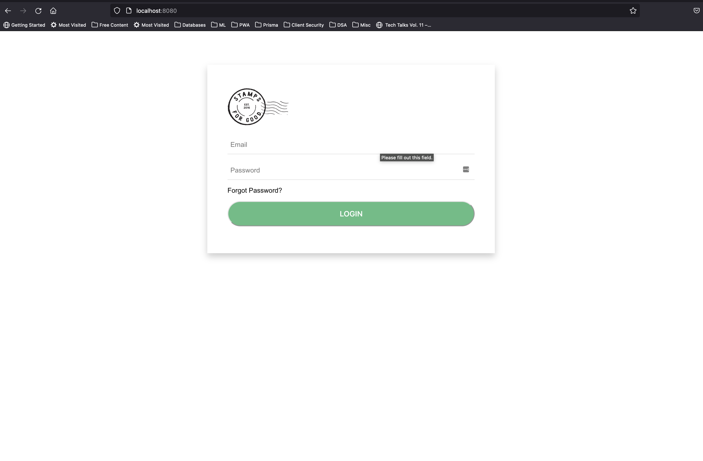
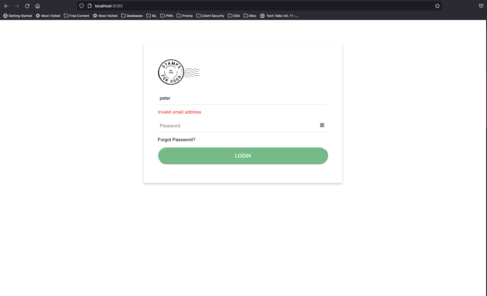
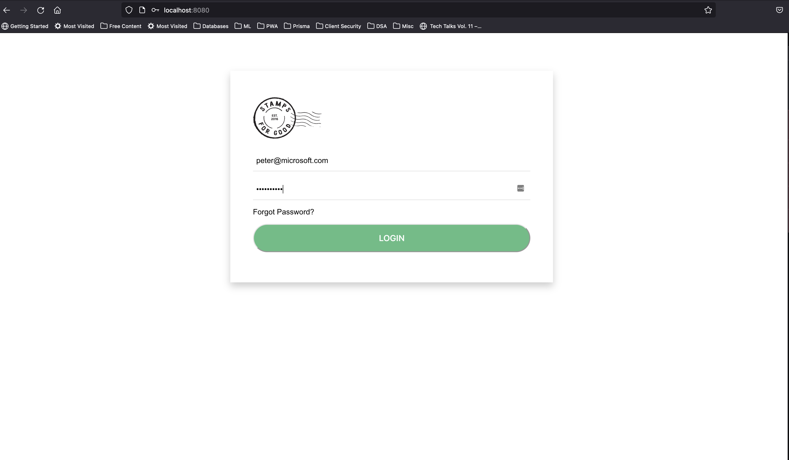
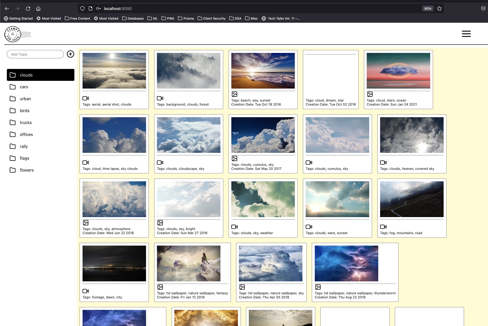
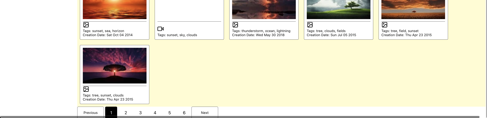
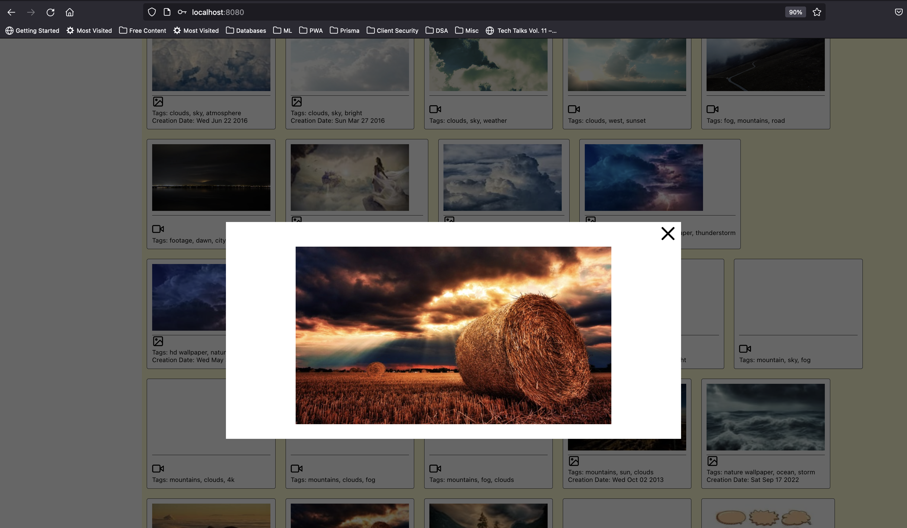
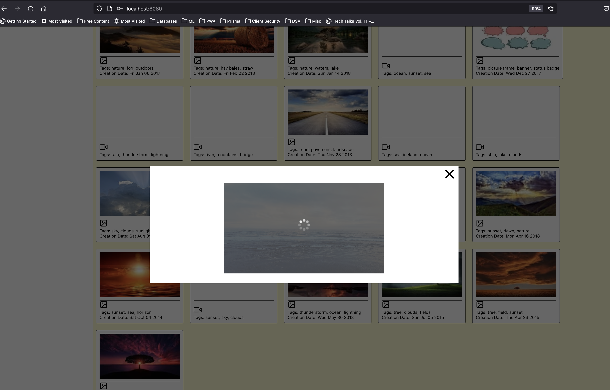

# Stamps
[https://stamps.fly.dev/](https://stamps.fly.dev/)

This application is built with React Js v.18 with a login feature and an image view feature, with images fetched from https://pixabay.com/api/.

Since this is for demo puposes, and we do not use any database to store the users, we only have two valid user credentials stored. The login accepts:

```
const Users = [{
  email: 'peter@microsoft.com',
  password: 'Aa11%$cccc'
}, {
  email: 'steve.creek@mydomain.net',
  password: 'g$jkKK44Q!'
}]
```

It uses [Formik](https://formik.org/docs/overview) forms to control both inputs by supplying them with initial values and managing `onChange` and `onBlur` events. Formik also manages the validation of input fields so that should one enter an invalid email address, they are immediately alerted.

## Getting Started

Setting up can be done in one of two ways:

### 1 Locally (without docker)

Install dependencies and start the app
```
npm ci && npm start
```
Access the app on [http://localhost:3000/](http://localhost:3000/)

 ### 2. Locally (with docker)

 ```
 docker build -t stamps:latest .
 ```
 Then run for the docker container:
 ```
docker-compose build stampservice && docker-compose up -d
 ```
Access the app on [http://localhost:80/](http://localhost:80/)

## Deployment

Deployment is done on [fly.io](https://fly.io). This service requires that the app is ran on Docker. There is an auto-generated file at the root of the project(`./fly.toml`). This file contains the configuration for fly to deploy the app.
Generate it by running:
```
flyctl launch --image natemmartin/stamps:latest
```
#### Note:
(`natemmartin/stamps:latest` is a docker image I have pushed to Docker Hub after building it locally)

```
docker build -t natemmartin/stamps:latest . && docker push natemmartin/stamps:latest
```

## Requirements

### 1 User Login
a) Login will allow a user to login / move to next view if the following
conditions are met
• Username is a valid email
• Password contains at least 8 characters and a combination of lowercase,
uppercase, number and a special character
Examples
• Valid usernames: peter@microsoft.com, steve.creek@mydomain.net
• see https://blogs.msdn.microsoft.com/testing123/2009/02/06/email-
address-test-cases/
• Valid passwords: “Aa11%$cccc”, “g$jkKK44Q!”
Expected Result - State of the art Login Page (basic style, icons, responsive)

### 2 Content Page
a) Use the following API
• https://pixabay.com/api/docs/
• Create a free account and get a development key
b) On the content page display a few folders. Each folder will have specific
search criteria in the API. For example
• Clouds
• Cars
• Urban (videos)
• (you can add more)
Show either a mix of videos and images in each folder or chose one folder to
show videos.
c) Display each item in a List
• Maximum of 50 items per page
• Items should be sorted by name
Each item will show the following
• Filename (e.g. “wave.mp4”)
• Icon based on file type such as video or image
• File content's resolution
• Creation Date (if the information is present in userImageURL or previewURL)
d) Clicking an item will show a preview overlay of the item (video / or image)
Expected Result - State of the art folder / list view with sorting function and (basic style, icons, responsive)

## Writeup

- **What choices did you make and why?** React JS was decided upon earlier on due to previous knowledge and the time it would take to ramp up on Ember JS would not be a feasible venture given the project timelines.
- **What challenges did you face?** I spent the bulk of time designing the project, learning the API, and creating the components that would display the images. I also spent some time adding the project to a Docker container in order to deploy it to [Fly.io](https://fly.io). However, there is still a deployment error to troubleshoot.
```
***v3 failed - Failed due to unhealthy allocations - no stable job version to auto revert to and deploying as v4

Troubleshooting guide at https://fly.io/docs/getting-started/troubleshooting/
Error abort
```
This left little time for writing comprehensive tests.

## Outcome

### Login Page





### Media Viewing Page





